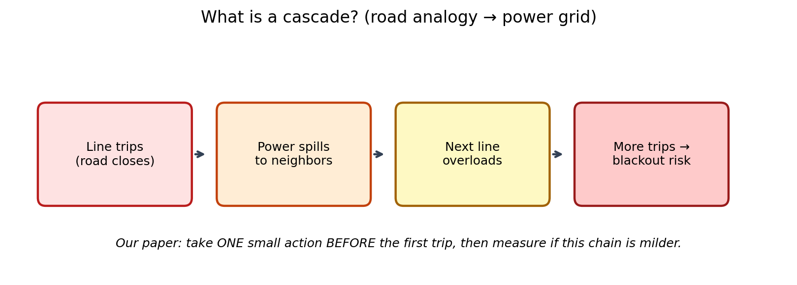
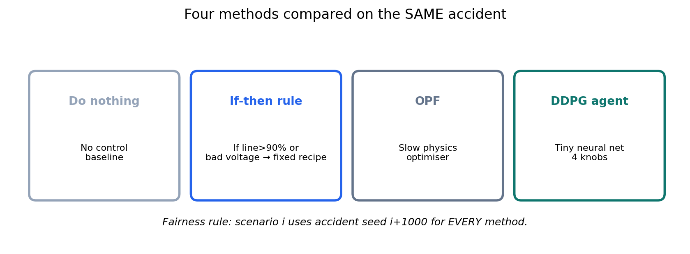
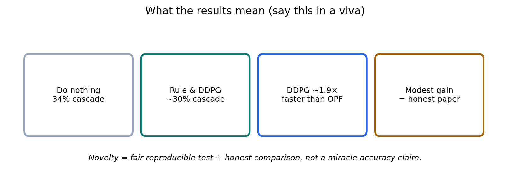
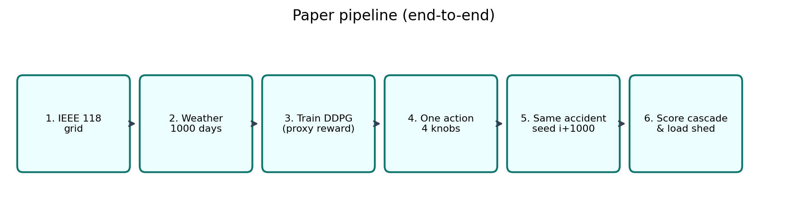
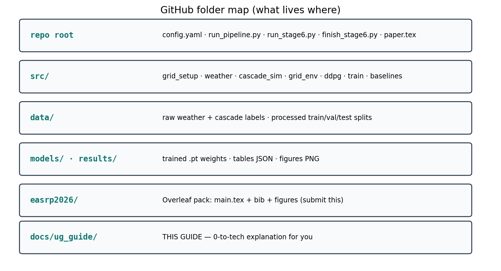
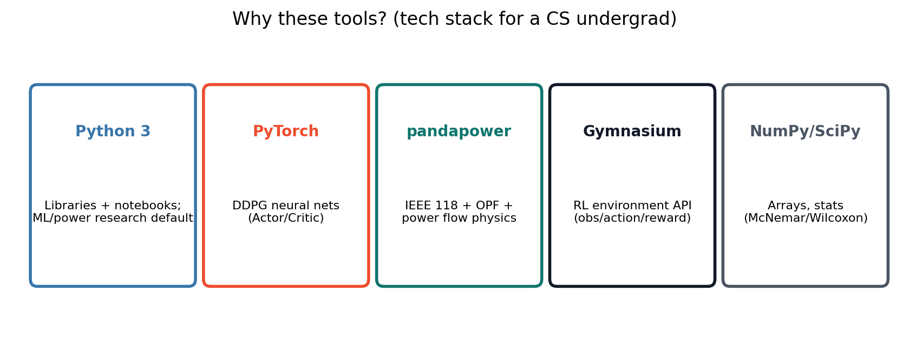
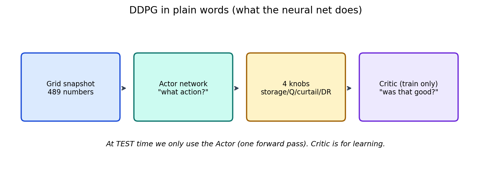

# 0-to-Tech Guide — Autonomous Grid Handling

**Who this is for:** you (UG CS researcher).  
**Goal:** explain the paper, the code, the folders, the tools, and *why* we chose them — without pretending you already know power-systems jargon.

**Repo:** https://github.com/theSaksham02/Autonomous-grid-handling  
**Submit pack (anonymous):** `easrp2026/`  
**This guide folder:** `docs/ug_guide/` (+ diagrams in `docs/ug_guide/diagrams/`)

---

## 0. One-sentence pitch (memorise this)

> We let a tiny learning agent take **one gentle move before** a grid accident, then check whether a **cascade (chain-reaction blackout)** happens less often than doing nothing — and we compare it fairly against a simple rule and a slow optimiser.

---

## 1. Zero → idea (no code yet)

### 1.1 What is a cascading failure?

Imagine a road network. One motorway lane closes → cars spill onto the next road → that road jams → more roads jam. In a power grid:

| Road analogy | Power grid |
|---|---|
| Road | Transmission **line** |
| Cars | Electrical **power** |
| Lane closed | Line **trips** (disconnects) |
| Traffic jam spreads | Overload → more trips → **cascade** |



Most AI papers on grids try to **react after** the first trip (emergency control).  
**Our paper asks something smaller and clearer:**

> If I am allowed **one small action while the grid is still intact**, does the later cascade get milder?

### 1.2 What are the “four knobs”?

The agent cannot rebuild the grid. It can only nudge:

1. **Storage** — charge/discharge a small battery (±15 MW)  
2. **Reactive power** — a bit of voltage support (±10 MVAr)  
3. **Curtail renewables** — slightly cut wind/solar (up to 20%)  
4. **Demand response** — slightly reduce load (up to 15%)

Tiny on purpose → explainable → hard to “cheat” by shedding half the city.

### 1.3 What do we compare?



| Method | Plain English |
|---|---|
| **Do nothing** | Baseline: apply weather, run accident |
| **If-then rule** | Handwritten recipe if lines/voltages look bad |
| **OPF** | Classical optimiser (slow, physics-aware) |
| **DDPG** | Small neural net that outputs the 4 knobs |

**Fairness:** for scenario `i`, every method gets the **same accident** (seed = `i + 1000`).

### 1.4 What did we find? (n = 150 test days)

| Method | Cascade rate | Meaning |
|---|---|---|
| Do nothing | **34%** | 51 / 150 days cascade |
| Rule / DDPG | **~30%** | Modest help |
| OPF | 32% | Helps a bit, **slow** (568 ms) |
| DDPG speed | ~299 ms | **~1.9× faster** than OPF |

Honest takeaway: **not a miracle**. Novelty is the **fair reproducible test**, not a fake 90% score.



---

## 2. Paper pipeline (end-to-end)



1. Load **IEEE 118-bus** grid (standard public test system).  
2. Stress it (180% loading) + inject **1000 weather days** (wind/solar).  
3. Train **DDPG** with a cheap proxy reward (healthy voltages/lines) — *not* the expensive cascade every step.  
4. At test: take **one** action at peak hour (hour 12).  
5. Replay a fixed N-k accident.  
6. Score **cascade yes/no** + **load shed** (how much demand dropped).

---

## 3. Folder / path map (what lives where)



```
Autonomous-grid-handling/
├── config.yaml              # ALL knobs (loading, seeds, episodes, action limits)
├── run_pipeline.py          # Stages 1–7 orchestrator
├── run_stage6.py            # Train DDPG + evaluate
├── finish_stage6.py         # Reload checkpoints → full n=150 table
├── paper.tex                # Older IEEE-style draft
├── requirements.txt         # Python packages
│
├── src/                     # Core Python code (see §5)
│   ├── grid_setup.py
│   ├── weather_renewables.py
│   ├── cascade_sim.py
│   ├── grid_env.py
│   ├── ddpg.py
│   ├── train.py
│   ├── baselines.py
│   └── ...
│
├── data/
│   ├── raw/                 # base_case.pkl, weather_scenarios.npz, cascade_results.npz
│   └── processed/           # train/val/test .npz + norm_stats.npz
│
├── models/trained_weights/  # best_ddpg_*.pt checkpoints
├── results/
│   ├── tables/              # all_results_n150.json, latex tables
│   └── figures/             # paper figures
│
├── easrp2026/               # ★ SUBMIT THIS to Overleaf (anonymous)
│   ├── main.tex
│   ├── easrp2026.sty
│   ├── references.bib
│   └── figures/
│
└── docs/ug_guide/           # ★ THIS GUIDE (for you, not for reviewers)
    ├── README.md            # (this file)
    └── diagrams/
```

### Paths you will actually touch

| Task | Path / command |
|---|---|
| Change experiment settings | `config.yaml` |
| Rebuild n=150 results | `python finish_stage6.py --n-test 150` |
| Rebuild figures | `python scripts/make_paper_figures.py` |
| Overleaf upload | whole `easrp2026/` folder |
| Read numbers | `results/tables/all_results_n150.json` |

---

## 4. Why Python? Why these libraries?



### Why Python (not C++ / Java / MATLAB)?

- Default language for **ML research** and student papers.  
- Huge ecosystem: PyTorch, NumPy, pandapower, Gymnasium.  
- Fast enough here because the bottleneck is **power-flow solves**, not raw loops.  
- Easy to put on **Colab / Kaggle** for free GPUs (GPU optional for this project).

### Library cheat-sheet

| Library | What it does here | Why we need it |
|---|---|---|
| **Python 3** | Glue language | Research standard |
| **PyTorch** | Actor & Critic neural nets | DDPG implementation |
| **pandapower** | IEEE 118 model, AC power flow, OPF | Grid physics without writing a solver |
| **Gymnasium** | RL env API (`reset` / `step` / spaces) | Clean RL interface |
| **NumPy / SciPy / pandas** | Arrays, CSV/NPZ, stats | Data + McNemar/Wilcoxon |
| **matplotlib / seaborn** | Figures | Paper plots |
| **PyYAML** | `config.yaml` | One place for all knobs |
| **tqdm** | Progress bars | Training visibility |

Install:

```bash
python -m venv .venv
source .venv/bin/activate
pip install -r requirements.txt
```

---

## 5. Code explanation (file by file)

### 5.1 Config — `config.yaml`

Single source of truth: grid loading, weather seed, RL hyperparameters, reward weights, file paths.  
**Change here first** before editing Python.

### 5.2 Grid — `src/grid_setup.py`

Loads IEEE 118 via pandapower, scales loads (180%), attaches wind/solar buses.  
Output: a pandapower `net` object saved as `data/raw/base_case.pkl`.

### 5.3 Weather — `src/weather_renewables.py`

Samples 1000 × 24h wind/solar/temperature profiles (seed 42).  
Maps weather → renewable MW using a turbine curve + solar day pattern.  
Output: `data/raw/weather_scenarios.npz`.

### 5.4 Cascade simulator — `src/cascade_sim.py`

Physics loop after an accident:

1. Apply weather at hour `h`  
2. Sample N-1 / N-2 / N-3 contingency (seeded)  
3. Trip elements  
4. Iterate: shed isolated load → power flow → trip overloaded lines → voltage checks  
5. Return severity / load-shed fraction  

This is the **judge** for all methods.

### 5.5 Features / splits — `src/feature_extraction.py`

Builds observation vectors + train/val/test splits → `data/processed/*.npz`.

### 5.6 RL environment — `src/grid_env.py`

Gymnasium env:

- **Observation:** ~489 numbers (voltages, line loadings, gens, weather look-ahead, trends, time)  
- **Action:** 4 continuous knobs  
- **Reward:** proxy (healthy grid), **not** full cascade during training  
- **Episode:** several hours; grid restored between hours  

### 5.7 Agent — `src/ddpg.py`



- **Actor:** obs → action in [-1,1]⁴  
- **Critic:** (obs, action) → Q-value (training only)  
- Replay buffer + optional **PER** (prioritized experience replay)  
- OU noise for exploration while training  

### 5.8 Training — `src/train.py`

Loop: interact with env → store transitions → update Actor/Critic → checkpoint best validation reward.  
Scripts: `run_stage6.py` (train + eval), `finish_stage6.py` (reload `.pt` → n=150 table).

### 5.9 Baselines — `src/baselines.py`

- Rule-based agent  
- Supervised MLP (predictor only — not used as preventor in headline table)  
- OPF via pandapower  

### 5.10 Paper / submit

| File | Use |
|---|---|
| `easrp2026/main.tex` | **Anonymous** EASRP submission |
| `paper.tex` | Older IEEE draft (kept) |
| `scripts/make_paper_figures.py` | Rebuild result figures |

---

## 6. Methods & evaluation (exam / viva answers)

### Q: What is DDPG?
Deep Deterministic Policy Gradient — continuous-control RL. Actor picks actions; Critic scores them.

### Q: Why not train on the cascade every step?
Cascade simulation is expensive. We train on a **proxy reward** (voltages + line loading + action cost), then evaluate with the real cascade.

### Q: What is “prevented”?
Days that cascaded with **do nothing** but **not** with the method. Also count “hurt” days (new cascades).

### Q: Why McNemar / Wilcoxon?
Paired tests on the **same** 150 days. Cascade yes/no → McNemar. Load shed → Wilcoxon.

### Q: Why is the gain small?
Action limits are tiny by design. A 10-line rule is competitive. That’s a **result**, not a failure.

### Q: What is TRL here?
Lab simulation (~TRL 4). **Not** a live utility deployment (don’t say TRL 6–7).

---

## 7. Commands cheat-sheet

```bash
# setup
python -m venv .venv && source .venv/bin/activate
pip install -r requirements.txt

# data (stages 1–5) then train
python run_pipeline.py --start 1 --end 5
python run_stage6.py

# full paper table (uses saved weights)
python finish_stage6.py --n-test 150

# figures
python scripts/make_paper_figures.py
```

Optional Colab GPU (not required — power flow is CPU):

```bash
colab new -s grid-eval --gpu T4
# note: `colab sessions` empty until you create one
```

---

## 8. How to explain the paper in 60 seconds

1. Cascades = chain-reaction blackouts (road jam analogy).  
2. We allow **one small preventive action** (4 knobs).  
3. Same accident for every method (fair).  
4. Do nothing 34% → rule/DDPG ~30%; DDPG ~2× faster than OPF.  
5. Honest modest result + open reproducible testbed = the contribution.

---

## 9. Diagram index

| File | Teaches |
|---|---|
| `diagrams/01_cascade_analogy.png` | What a cascade is |
| `diagrams/02_paper_pipeline.png` | End-to-end pipeline |
| `diagrams/03_four_methods.png` | Baselines vs agent |
| `diagrams/04_repo_map.png` | Folder structure |
| `diagrams/05_ddpg_plain.png` | Actor/Critic intuition |
| `diagrams/06_tech_stack.png` | Why Python + libs |
| `diagrams/07_results_story.png` | How to read results |
| `diagrams/08_cascade_visual_poster.png` | Visual cascade poster |
| `diagrams/09_architecture_poster.png` | Architecture flow poster |

---

## 10. What is on Google Drive vs GitHub

| Place | Content |
|---|---|
| **GitHub** | Code + this guide + diagrams + EASRP pack |
| **Google Drive (EuroTech folder)** | Same UG guide + diagrams (for studying; not for anonymous submit) |
| **Overleaf** | Only `easrp2026/` (anonymous PDF) |

If Drive upload fails from this machine, drag-and-drop the folder  
`docs/ug_guide/` into:  
https://drive.google.com/drive/folders/14u9Y-cEA794DIuLgxo2GIwl4SN8uelao
